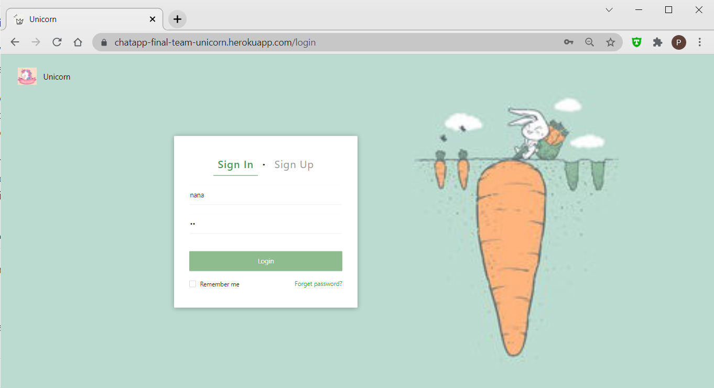

# 1 Getting Started with Create React App

This project was bootstrapped with [Create React App](https://github.com/facebook/create-react-app). So if you want to compile in your own environment,  following the instructions.

## Available Scripts to Start

### `yarn start`

Runs the app in the development mode.\
Open [http://localhost:3000](http://localhost:3000) to view it in the browser.

The page will reload if you make edits.\
You will also see any lint errors in the console.

# 2 Tech Detail

The project is mainly based on React, with node.js to compile.

#data store

Use redux to connect different pages with data.

#instant message

Use websocket to realize the message conveying among clients(users).

#UI component

Use Ant Design to optimize the component in the web.

# 3 Functions

<u>Login and Sign up.</u>

<u>Create a chat room.</u>

<u>Join a chatroom.</u>

<u>Send message and everyone in that room will receive it.</u>

<u>Recall a message.</u>

<u>Use power of admin to delete a user from one chat room or ban a user to talk.</u>

Future Improvement:

use socket.io to replace websocket to realize more strong and reliable instant messaging.

most logic now use ugly buttons to connect. Try more cute and friendly design.

no **encryption** used to pwd when send to back-end. It's very unsafe.

# 4 Show

We have put our final website on Youtube:

https://www.youtube.com/watch?v=uQ3h1xRaeJ8

Or, we have deployed the whole project in Heroku. So you can visit it through:

https://chatapp-final-team-unicorn.herokuapp.com/

